# Parallel Matrix Multiplication

> High-performance computing comparative benchmark evaluating dense matrix multiplication ($4000 \times 4000$) across **Sequential CPU**, **OpenMP Shared Memory**, **MPI Distributed Cluster**, and **NVIDIA CUDA GPU** architectures.

[](src/)
[](src/openmp/openmpmatrix.c)
[](src/mpi/mpimatrix.c)
[](src/cuda/cudamatrix.cu)
[](results/)

---

## Quick Project Summary

| Parameter | Specification | Details / Notes |
| :--- | :--- | :--- |
| **Workload** | Dense Matrix Multiplication | $C = A \times B$ |
| **Matrix Dimension** | $4000 \times 4000$ elements | $1.6 \times 10^7$ double / single precision cells |
| **Computational Complexity** | $\mathcal{O}(N^3)$ | $\approx 1.28 \times 10^{11}$ Floating-Point Operations (FLOPs) |
| **Implementations** | 4 Computing Models | Sequential CPU / OpenMP / MPI / CUDA |
| **Input Matrices** | Uniform Initializations | $A[i][j] = 1.0, \quad B[i][j] = 1.0$ |
| **Verification Metric** | Deterministic Check | $C[0][0] = 4000.00$ verified across all implementations |

---

## Project Pipeline

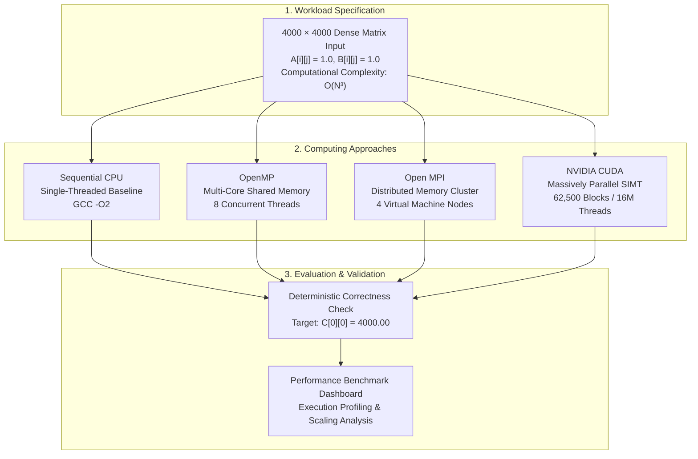

---

## Computing Models

| Implementation | Execution Model | Memory Model | Parallelism Strategy | Technology Stack |
| :--- | :--- | :--- | :--- | :--- |
| **Sequential** | Single-threaded | Local CPU Cache / RAM | None (strictly serial loop execution on 1 core) | Pure C (GCC `-O2`) |
| **OpenMP** | Multi-threaded | Shared memory space | Loop iterations are distributed among OpenMP threads | OpenMP API (`#pragma omp parallel for`) |
| **MPI** | Multi-process | Distributed memory (isolated) | Domain decomposition across 4 networked virtual machines | Open MPI (`MPI_Scatter`, `MPI_Bcast`, `MPI_Gather`) |
| **CUDA** | Massively parallel (SIMT) | Dedicated GPU VRAM | 2D Grid / Block thread mapping ($1$ thread per output element) | NVIDIA CUDA C (`nvcc -O2`) |

---

## Workload and Correctness

| Attribute | Specification | Formula / Description |
| :--- | :--- | :--- |
| **Matrix Dimensions** | $4000 \times 4000$ | $N = 4000$ |
| **Matrix $A$ Values** | $1.0$ | $A[i][j] = 1.0 \quad \forall\ i, j \in [0, 3999]$ |
| **Matrix $B$ Values** | $1.0$ | $B[i][j] = 1.0 \quad \forall\ i, j \in [0, 3999]$ |
| **Operation** | Matrix Multiplication | $C[i][j] = \sum_{k=0}^{N-1} A[i][k] \times B[k][j]$ |
| **Algorithmic Complexity** | $\mathcal{O}(N^3)$ | $2 \times N^3 = 1.28 \times 10^{11}$ arithmetic operations |
| **Expected Value** | $C[0][0] = 4000.00$ | Correctness threshold for every tested model |

> [!NOTE]
> **Correctness Proof**: Because all elements of both operands $A$ and $B$ are initialized to $1.0$, each resulting cell represents the summation of 4000 multiplications of $1.0 \times 1.0$:
> $$C[i][j] = \sum_{k=0}^{3999} (1.0 \times 1.0) = \sum_{k=0}^{3999} 1.0 = 4000.00$$
> Validating $C[0][0] = 4000.00$ provides an immediate and exact verification of algorithmic correctness across all computing models.

---

## Source Code Navigation

| Implementation | Source File Link | Description / Implementation Highlights |
| :--- | :--- | :--- |
| **Sequential CPU** | [`src/sequential/seqmatrix.c`](src/sequential/seqmatrix.c) | Single-threaded baseline implementation using classic triple-nested loops in C. |
| **OpenMP** | [`src/openmp/openmpmatrix.c`](src/openmp/openmpmatrix.c) | Shared-memory implementation distributing row-outer loops across 8 threads via OpenMP directives. |
| **MPI Matrix Multiplication** | [`src/mpi/mpimatrix.c`](src/mpi/mpimatrix.c) | Distributed cluster matrix multiplication with row-wise scattering, matrix broadcasting, and gathering. |
| **MPI Communication Test** | [`src/mpi/sendandreceive.c`](src/mpi/sendandreceive.c) | Point-to-point communication benchmark verifying inter-process message passing via `MPI_Send` / `MPI_Recv`. |
| **CUDA GPU** | [`src/cuda/cudamatrix.cu`](src/cuda/cudamatrix.cu) | GPU kernel with 16 million CUDA threads launched across 62,500 blocks ($250 \times 250$ grid, $16 \times 16$ block) and CUDA event timing. |

---

## Architecture Visualization

### 1. Sequential CPU Architecture
A single CPU execution unit sequentially computes all rows and columns using triple-nested loops.

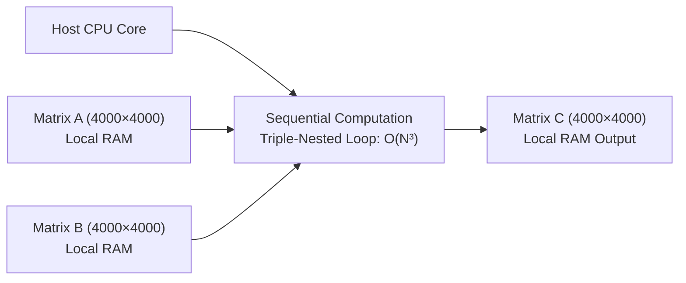

### 2. OpenMP Shared-Memory Architecture
A master thread forks 8 worker threads that simultaneously execute chunks of the outer matrix loop over a shared address space.

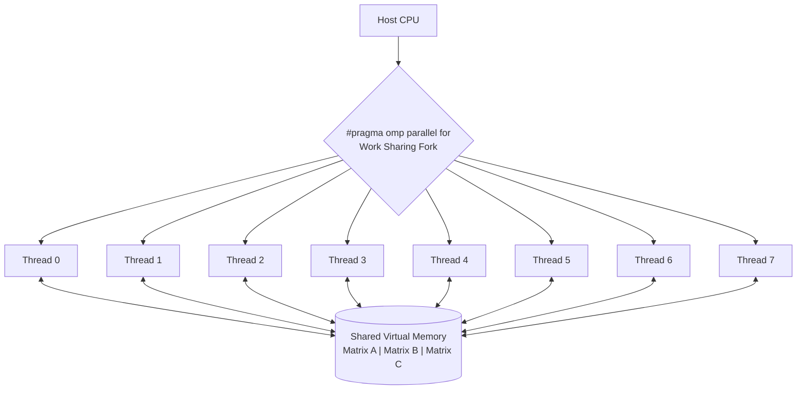

### 3. MPI Distributed-Memory Architecture
Domain decomposition across 4 independent VM nodes connected via virtual networking. Matrix $A$ rows are scattered, Matrix $B$ is broadcast, and computed row blocks are gathered back to the Master node.

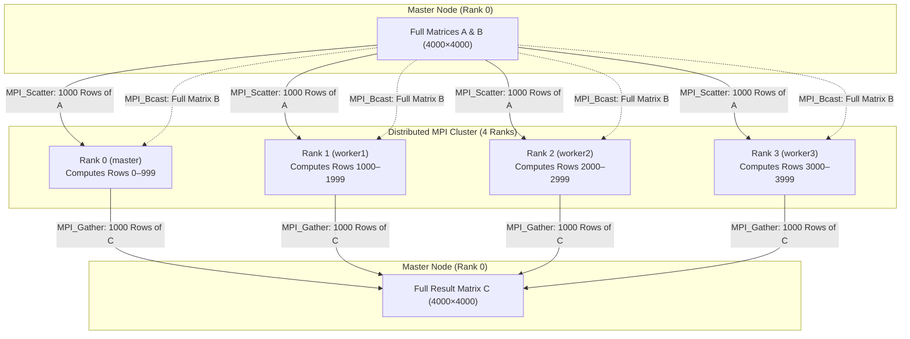

### 4. CUDA Massively Parallel Architecture
The host allocates GPU device memory, transfers input matrices across the PCIe bus, launches 16 million CUDA threads across 62,500 blocks ($250 \times 250$ grid of $16 \times 16$ blocks), and copies the result back to host memory.

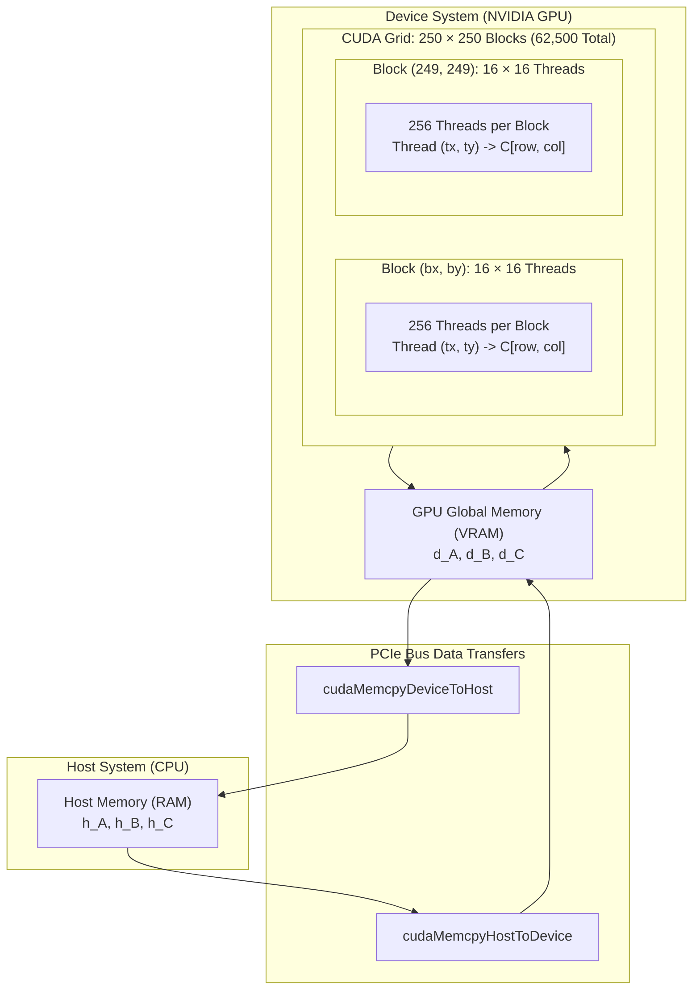

---

## Performance Dashboard

> [!IMPORTANT]
> **Measurement Source Notice**:
> - **Sequential**, **OpenMP**, and **MPI** timings originate from the **original reference experiment**.
> - **CUDA** timing originates from the **current reproduced measurement** on an **NVIDIA GeForce RTX 3050 6GB** (Windows, `nvcc -O2 -arch=sm_86`).
> - Because hardware environments differ, the cross-paradigm speedup comparison is illustrative and **not a controlled same-hardware benchmark**.

| Implementation | Hardware / Resources | Execution Time | Speedup Factor | Verification | Measurement Type |
| :--- | :--- | ---: | ---: | :---: | :--- |
| **Sequential CPU** | 1 CPU Core (Single-Threaded) | `321.280 s` | `1.00×` (Baseline) | $C[0][0] = 4000.00$ | Reference measurement |
| **OpenMP** | 8 CPU Cores (Shared Memory) | `104.490 s` | `3.07×` | $C[0][0] = 4000.00$ | Reference measurement |
| **MPI Cluster** | 4 VM Nodes (Distributed Network) | `226.170 s` | `1.42×` | $C[0][0] = 4000.00$ | Reference measurement |
| **CUDA (Total Phase)** | NVIDIA GPU (Grid $250 \times 250$, Block $16 \times 16$) | `0.273303 s` | `1175.55×` | $C[0][0] = 4000.00$ | Current reproduced measurement |

> [!NOTE]
> **CUDA Timing Details**:
> - **Kernel Execution Time**: `0.249214 s` (`249.214 ms`), captured via high-precision `cudaEvent` timers placed immediately around the kernel launch.
> - **Total CUDA Phase Time**: `0.273303 s`, covering host-to-device transfer, kernel execution, device-to-host transfer, and synchronization.
> - The overall speedup comparison (`1175.55×`) uses the total CUDA phase time against the sequential reference time (`321.280 s`). Because these measurements were obtained in different hardware environments, this comparison is illustrative rather than a controlled same-hardware benchmark.

---

## Performance Visualization

> [!NOTE]
> **Reference Performance Visualization**: The charts below illustrate the baseline execution times and speedup factors recorded during the original multi-core CPU and MPI distributed cluster experiments. They represent the reference dataset.

### Reference Performance Comparison Charts

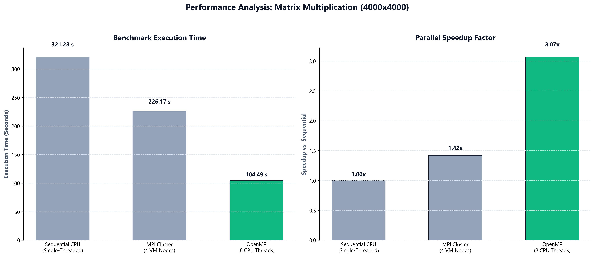

<details>
<summary><b>View Individual Reference Performance Charts</b></summary>

#### Standalone Execution Time Chart
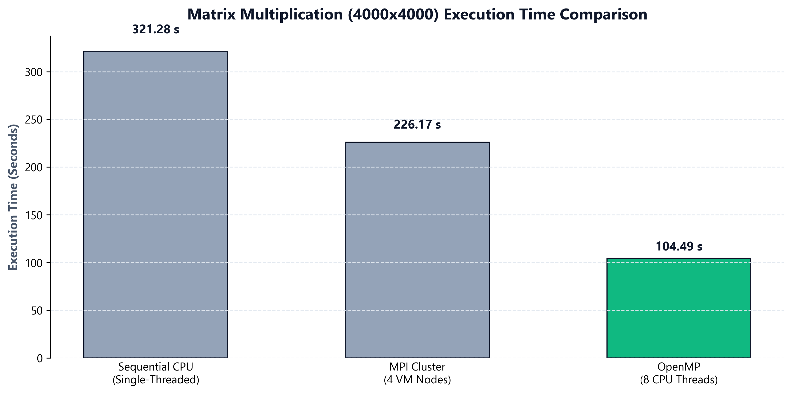

#### Standalone Speedup Factor Chart
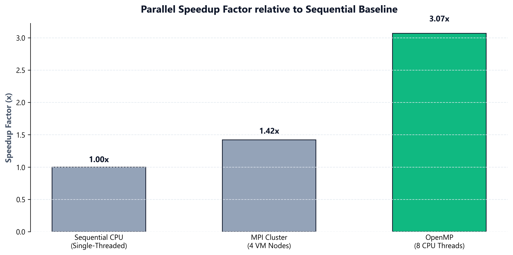

</details>

---

## CUDA Benchmark

### Benchmark Configuration & Results

| Metric | Configuration & Measured Value |
| :--- | :--- |
| **Workload Dimensions** | $4000 \times 4000$ dense matrix ($16,000,000$ elements) |
| **CUDA Block Dimensions** | $16 \times 16$ threads per block |
| **CUDA Grid Dimensions** | $250 \times 250$ blocks ($62,500$ blocks) |
| **Threads Launched** | **16 million CUDA threads across 62,500 blocks**<br/>($250 \times 250$ blocks, $16 \times 16$ threads per block, $62,500$ blocks, $16,000,000$ threads) |
| **Kernel Execution Time** | **`249.214 ms`** (`0.249214 s`) — kernel-only, measured via `cudaEvent` timers |
| **Total CUDA Phase Time** | **`0.273303 s`** — includes H2D transfer, kernel execution, D2H transfer, and synchronization |
| **Correctness Verification** | **`C[0][0] = 4000.00`** |
| **Measurement Source** | Current reproduced measurement (NVIDIA GeForce RTX 3050 6GB, `nvcc -O2 -arch=sm_86`) |

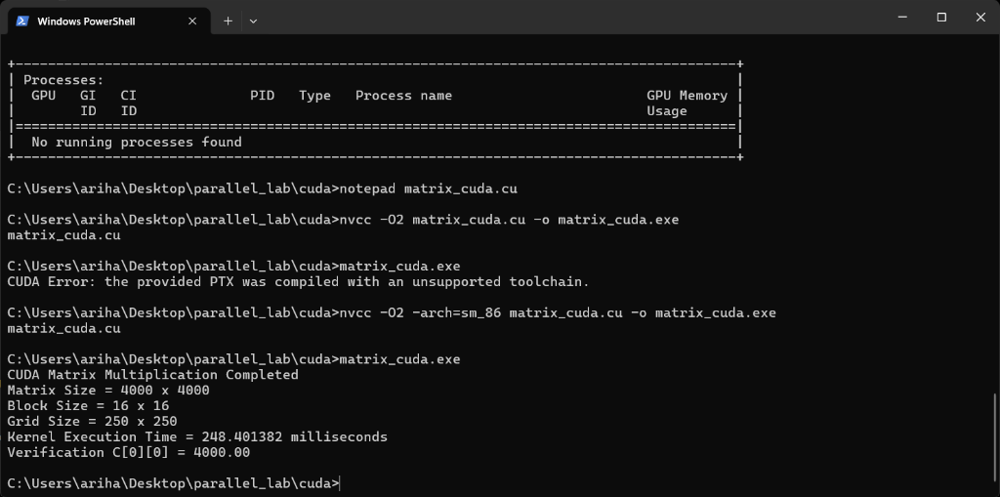

**CUDA execution result — 4000 × 4000 matrix multiplication**

### CUDA Execution Workflow

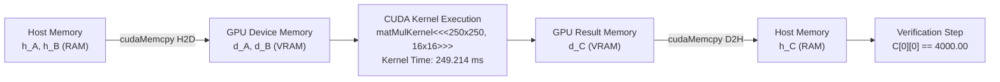

> [!IMPORTANT]
> **Measurement Scope**:
> - The recorded **`249.214 ms`** (`0.249214 s`) reflects the computational time spent executing `matMulKernel<<<grid, block>>>` on the GPU streaming multiprocessors, captured via `cudaEvent` timers.
> - The **total CUDA phase time** is **`0.273303 s`**, which includes host-to-device transfer (`cudaMemcpyHostToDevice`), kernel execution, device-to-host transfer (`cudaMemcpyDeviceToHost`), and synchronization.
> - The overall performance comparison uses `0.273303 s` for a fair end-to-end comparison against CPU and MPI runtimes.

---

## MPI Communication

The distributed MPI implementation relies on point-to-point and collective communication protocols across virtual machine nodes.

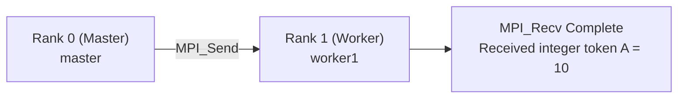

### Cluster Communication Verification

<details open>
<summary><b>1. Network Connectivity & ICMP Ping Verification</b></summary>

Verification of zero packet loss and low latency across the 4-node VM cluster (`master`, `worker1`, `worker2`, `worker3`).

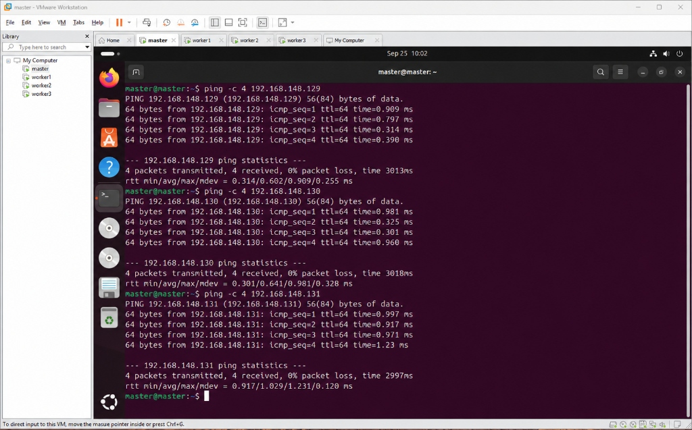

</details>

<details open>
<summary><b>2. Inter-Process Point-to-Point Communication</b></summary>

Validation of `MPI_Send` and `MPI_Recv` routines exchanging data across cluster ranks.

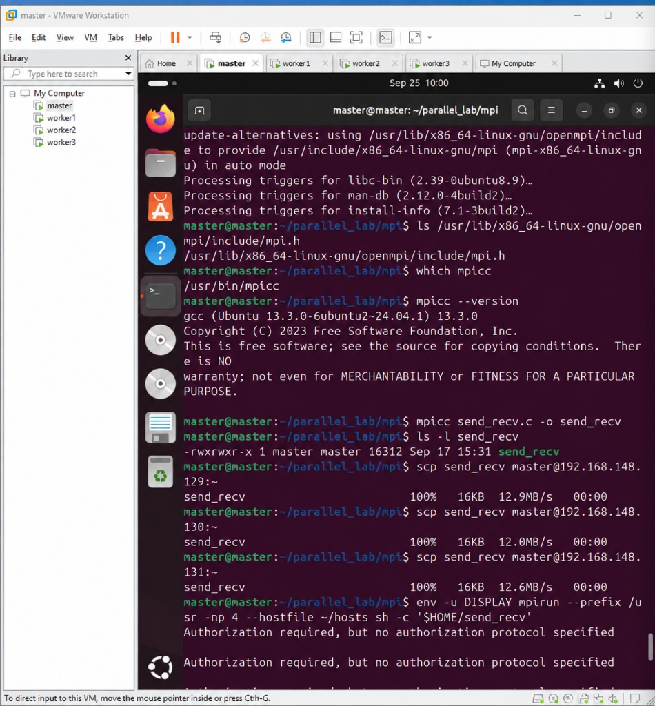

</details>

---

## Implementation Details

<details>
<summary><b>1. Sequential CPU Implementation</b></summary>

- **Source File**: [`src/sequential/seqmatrix.c`](src/sequential/seqmatrix.c)
- **Concept**: Straightforward serial execution using three nested loops iterating from $0$ to $N-1$.
- **Memory Allocation**: Contiguous heap allocation using `malloc(N * N * sizeof(double))`.
- **Complexity**: $\mathcal{O}(N^3)$ compute steps executed strictly on one CPU core.


</details>

<details>
<summary><b>2. OpenMP Shared-Memory Implementation</b></summary>

- **Source File**: [`src/openmp/openmpmatrix.c`](src/openmp/openmpmatrix.c)
- **Concept**: Thread-level parallelism leveraging `#pragma omp parallel for private(j, k)` to parallelize the outermost loop across 8 cores.
- **Memory Address Space**: Single unified virtual memory space; worker threads read from matrices $A$ and $B$ and write to non-overlapping rows of matrix $C$ without synchronization contention.

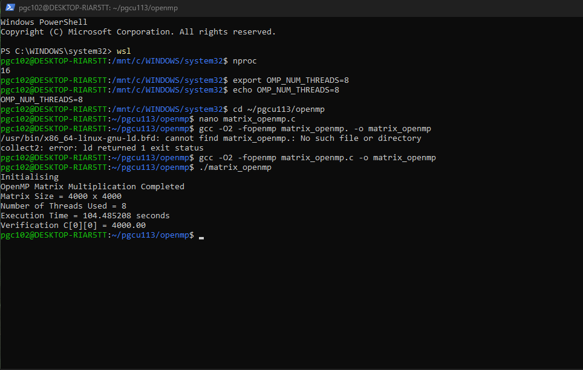

</details>

<details>
<summary><b>3. MPI Distributed-Memory Implementation</b></summary>

- **Source File**: [`src/mpi/mpimatrix.c`](src/mpi/mpimatrix.c)
- **Concept**: Domain decomposition across 4 independent VM nodes (`master`, `worker1`, `worker2`, `worker3`).
- **Communication Pattern**:
  - `MPI_Scatter`: Distributes row-blocks of Matrix $A$ ($1000$ rows per rank).
  - `MPI_Bcast`: Replicates the entire Matrix $B$ ($4000 \times 4000$) to all ranks.
  - `MPI_Gather`: Assembles computed row-blocks of Matrix $C$ back to Rank 0.


</details>

<details>
<summary><b>4. CUDA GPU Implementation</b></summary>

- **Source File**: [`src/cuda/cudamatrix.cu`](src/cuda/cudamatrix.cu)
- **Concept**: Massively parallel SIMT execution on GPU hardware.
- **Decomposition**:
  - Each thread computes exactly one cell $C[\text{row}][\text{col}]$ using global indexing:
    $$\text{row} = \text{blockIdx.y} \times \text{blockDim.y} + \text{threadIdx.y}$$
    $$\text{col} = \text{blockIdx.x} \times \text{blockDim.x} + \text{threadIdx.x}$$
  - Thread hierarchy: 16 million CUDA threads launched across 62,500 blocks ($250 \times 250$ blocks, $16 \times 16$ threads per block, $62,500$ blocks, $16,000,000$ threads launched).
- **Instrumentation**: Hardware event timers (`cudaEvent_t`) measure pure kernel latency.

</details>

---

## How to Run

<details>
<summary><b>1. Sequential CPU Instructions (Ubuntu / WSL2)</b></summary>

```bash
# Navigate to sequential source directory
cd src/sequential

# Compile with optimization
gcc -O2 seqmatrix.c -o seqmatrix

# Execute
./seqmatrix
```

</details>

<details>
<summary><b>2. OpenMP Instructions (Ubuntu / WSL2)</b></summary>

```bash
# Navigate to OpenMP source directory
cd src/openmp

# Configure thread count
export OMP_NUM_THREADS=8

# Compile with OpenMP flag
gcc -O2 -fopenmp openmpmatrix.c -o openmpmatrix

# Execute
./openmpmatrix
```

</details>

<details>
<summary><b>3. MPI Instructions (Distributed VM Cluster)</b></summary>

```bash
# Navigate to MPI source directory
cd src/mpi

# Verify cluster network connectivity
mpicc -O2 sendandreceive.c -o sendandreceive
mpirun -np 2 --hostfile hosts ./sendandreceive

# Compile distributed matrix multiplication
mpicc -O2 mpimatrix.c -o mpimatrix

# Distribute binary to worker nodes (if required)
scp mpimatrix worker1:~/mpimatrix
scp mpimatrix worker2:~/mpimatrix
scp mpimatrix worker3:~/mpimatrix

# Execute across 4 ranks
mpirun -np 4 --hostfile hosts ./mpimatrix
```

</details>

<details>
<summary><b>4. CUDA Instructions (NVIDIA CUDA Environment)</b></summary>

```bash
# Navigate to CUDA source directory
cd src/cuda

# Verify GPU device and compiler
nvidia-smi
nvcc --version

# Compile with NVIDIA CUDA Compiler
nvcc -O2 cudamatrix.cu -o cudamatrix

# Execute
./cudamatrix
```

</details>

---

## Project Structure

```text
Parallel-Matrix-Multiplication/
├── README.md
├── .gitignore
├── docs/
├── results/
│   ├── sequential/
│   │   ├── execution/
│   │   │   └── sequential_result.jpg
│   │   └── performance/
│   │       └── execution_time_chart.png
│   ├── openmp/
│   │   ├── execution/
│   │   │   └── openmp_result.png
│   │   └── performance/
│   ├── mpi/
│   │   ├── execution/
│   │   │   └── mpi_result.png
│   │   ├── communication/
│   │   │   ├── mpi_ping.jpg
│   │   │   └── mpi_send_recv.jpg
│   │   └── performance/
│   │       ├── performance_comparison_charts.png
│   │       └── speedup_chart.png
│   └── cuda/
│       ├── execution/
│       │   └── cuda_result.png
│       └── performance/
├── scripts/
│   └── chart.py
└── src/
    ├── sequential/
    │   └── seqmatrix.c
    ├── openmp/
    │   └── openmpmatrix.c
    ├── mpi/
    │   ├── mpimatrix.c
    │   └── sendandreceive.c
    └── cuda/
        └── cudamatrix.cu
```

---

## Results and Observations

- **Sequential Baseline**: Sequential execution processes one instruction stream on a single CPU core, resulting in a runtime of $321.280\text{ s}$ bound by clock speed and the cubic complexity $\mathcal{O}(N^3)$ of dense matrix multiplication.
- **OpenMP Shared-Memory Parallelism**: OpenMP distributes loop iterations across 8 CPU threads within a shared memory space, achieving $104.490\text{ s}$ ($3.07\times$ speedup over the reference baseline) without requiring inter-process data communication.
- **MPI Distributed-Memory Parallelism**: The MPI cluster distributes computation across 4 VM nodes in $226.170\text{ s}$ ($1.42\times$ speedup over the reference baseline). Communication overhead—scattering rows of Matrix $A$ and broadcasting Matrix $B$ across virtual network adapters—contributes significantly to total runtime.
- **CUDA Massively Parallel SIMT**: The CUDA implementation offloads matrix multiplication to the GPU, mapping every output cell to an individual thread across $62,500$ blocks. The current reproduced benchmark (NVIDIA GeForce RTX 3050 6GB) recorded a kernel execution time of $249.214\text{ ms}$ ($0.249214\text{ s}$) and a total CUDA phase time of $0.273303\text{ s}$, yielding an illustrative $1175.55\times$ speedup against the sequential reference.
- **Deterministic Verification**: The implementations use $C[0][0] = 4000.00$ as the correctness check. The current reproduced CUDA run verified this value successfully.

---

## Future Work

- **Multi-Run Statistical Profiling**: Execute each implementation across multiple iterations to evaluate mean runtimes and standard deviations.
- **Controlled Cross-Architecture Benchmarking**: Repeat all implementations on the same hardware and runtime environment for statistically comparable end-to-end measurements.
- **Hardware Counter & Cache Analysis**: Profile L1/L2 cache misses, memory bandwidth utilization, and GPU streaming multiprocessor (SM) occupancy.
- **Workload Scalability**: Evaluate performance across varied problem sizes ($N = 1000, 2000, 4000, 8000$) to observe communication vs. computation scaling behavior.
- **Unified Visualizations**: Generate updated multi-paradigm benchmark charts incorporating verified measurements across all architectures.

---

## Technologies

| Category | Technology | Usage in Project |
| :--- | :--- | :--- |
| **Primary Language** | C (C99) | High-performance implementation of matrix multiplication routines |
| **Shared-Memory API** | OpenMP | Compiler directives for multi-threaded CPU parallelization |
| **Distributed Messaging** | Open MPI | Message-passing interface for cluster communication across VM nodes |
| **GPU Computing** | NVIDIA CUDA | SIMT parallel computing platform and kernel execution |
| **Visualization** | Python / Matplotlib | Generation of performance comparison and speedup factor charts |
| **Environments** | Ubuntu on WSL2 & VMware | Host and virtualized environments for compilation, testing, and clustering |
